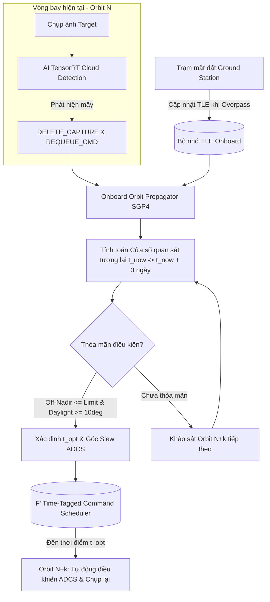

# Giải pháp Tự động Chụp lại ảnh và Dự báo Quỹ đạo Onboard (Autonomous Retake & Orbit Propagation)

Document Status: Active  
Target Systems: `cube_nano` OBC (Onboard Computer), ADCS, F' Flight Software  

---

## 1. Đặt vấn đề & Thách thức Kỹ thuật

Trong nhiệm vụ quan sát Trái Đất (Earth Observation) bằng vệ tinh nhỏ (CubeSat/NanoSat):
- **Phát hiện mây onboard**: Khi AI onboard (`DecisionPolicy` / TensorRT) phát hiện mây che phủ mục tiêu, ảnh bị loại bỏ (`DELETE_CAPTURE`) để tiết kiệm dung lượng lưu trữ onboard và băng thông truyền dữ liệu xuống (downlink).
- **Yêu cầu chụp lại (Retake)**: Lệnh chụp ảnh mục tiêu đó phải được giữ lại và tự động thực hiện lại vào lần bay qua (pass) tiếp theo.
- **Ràng buộc truyền thông**: Trạm mặt đất (Ground Station - GS) chỉ cập nhật tham số quỹ đạo (TLE/Ephemeris) cho vệ tinh khi vệ tinh bay qua trạm mặt đất (vài lần/ngày).
- **Thách thức**: 
  1. Vệ tinh cần tự xác định vị trí quỹ đạo của nó ở các vòng bay tương lai mà không cần kết nối thời gian thực với trạm mặt đất.
  2. Do Trái Đất tự quay quanh trục (15°/giờ), quỹ đạo mặt đất (Ground Track) ở các chu kỳ tiếp theo ($N+1, N+2, \dots$) sẽ bị dịch chuyển về phía Tây. Vệ tinh phải tự tính toán chính xác cửa sổ thời gian ($t_{\text{opt}}$) và góc nhìn (Off-nadir angle) thỏa mãn điều kiện chụp.

---

## 2. Nguyên lý Giải pháp Cốt lõi

Hệ thống giải quyết bài toán thông qua 3 thành phần chính:

1. **Bộ lan truyền Quỹ đạo Onboard (Onboard Orbit Propagator - SGP4)**:
   Vệ tinh lưu trữ bộ TLE mới nhất từ GS trong bộ nhớ Flight Memory. Thuật toán **SGP4 (Simplified General Perturbations 4)** trên OBC cho phép lan truyền quỹ đạo (Orbit Propagation) để tính chính xác vị trí & vận tốc vệ tinh tại bất kỳ mốc thời gian $t$ nào trong tương lai (với độ chính xác $< 1\text{ km}$ trong vòng 24–48h).

2. **Dự báo Cửa sổ Quan sát Mục tiêu (Target Pass Prediction)**:
   OBC quét mốc thời gian tương lai, chuyển đổi tọa độ mục tiêu $(\text{Lat}, \text{Lon}, \text{Alt})$ và vị trí vệ tinh sang hệ tọa độ cố định Trái Đất (ECEF), tính toán góc nghiêng quan sát (Off-nadir Angle $\eta(t)$) và điều kiện chiếu sáng Mặt Trời (Sun Elevation).

3. **Hàng đợi Lệnh Chụp lại (Persistent Re-take Queue)**:
   Khi nhãn `DELETE_CAPTURE` được đưa ra:
   - Xóa file ảnh mây trên bộ nhớ Flash.
   - Giữ lại thông tin Lệnh Chụp (`Target_ID`, `Lat`, `Lon`, `Camera_Config`).
   - Đăng ký lịch chụp mới vào hệ thống quản lý lệnh theo thời gian (Time-Tagged Scheduler của F' Flight Software).

---

## 3. Sơ đồ Kiến trúc & Luồng Thực thi (System Workflow)




---

## 4. Mô hình Toán học Onboard

### 4.1. Lan truyền Quỹ đạo (SGP4 Propagation)
Tại thời điểm tương lai $t$, vị trí và vận tốc vệ tinh trong hệ TEME (True Equator Mean Equinox) được tính bằng SGP4:
$$\left(\vec{r}_{\text{sat,TEME}}(t), \vec{v}_{\text{sat,TEME}}(t)\right) = \text{SGP4}(\text{TLE}, t)$$

Chuyển đổi sang hệ tọa độ ECEF (Earth-Centered Earth-Fixed):

$$\vec{r}_{\text{sat,ECEF}}(t) = \mathbf{R}_z\left(\theta_{\text{GST}}(t)\right) \cdot \vec{r}_{\text{sat,TEME}}(t)$$

trong đó $\theta_{\text{GST}}(t)$ là góc giờ vũ trụ Greenwich (Greenwich Sidereal Time) tại $t$.

### 4.2. Tọa độ Mục tiêu trong ECEF
Mục tiêu $T$ có tọa độ địa lý $(\phi, \lambda, h)$ được chuyển sang ECEF theo chuẩn WGS84:

$$
\begin{aligned}
X_T &= \left(N(\phi) + h\right) \cos\phi \cos\lambda \\
Y_T &= \left(N(\phi) + h\right) \cos\phi \sin\lambda \\
Z_T &= \left(N(\phi)(1 - e^2) + h\right) \sin\phi
\end{aligned}
$$

Trong đó, bán kính cong theo hướng thẳng đứng chính (Prime Vertical Radius of Curvature) $N(\phi)$ được tính bằng:

$$N(\phi) = \frac{a}{\sqrt{1 - e^2 \sin^2\phi}}$$

Các hằng số WGS84:
- $a = 6378137.0\text{ m}$ (Bán trục lớn Earth Semi-major axis)
- $e^2 = 0.00669437999014$ (Độ lệch tâm bình phương First eccentricity squared)


### 4.3. Vector Tầm nhìn & Góc Off-nadir
Vector chỉ từ vệ tinh đến mục tiêu:

$$\vec{\rho}_{\text{ECEF}}(t) = \vec{r}_{T,\text{ECEF}} - \vec{r}_{\text{sat,ECEF}}(t)$$

Góc nghiêng quan sát so với Nadir (Off-nadir angle $\eta(t)$):

$$\cos\eta(t) = \frac{-\vec{\rho}_{\text{ECEF}}(t) \cdot \vec{r}_{\text{sat,ECEF}}(t)}{\|\vec{\rho}_{\text{ECEF}}(t)\| \cdot \|\vec{r}_{\text{sat,ECEF}}(t)\|}$$

### 4.4. Điều kiện Lập lịch Chụp (Feasibility Constraints)
Một thời điểm $t$ được chấp nhận làm lịch chụp lại nếu thỏa mãn:
1. **Góc quan sát nằm trong giới hạn camera/ADCS**: $\eta(t) \le \eta_{\text{max}}$.
   - Vệ tinh hỗ trợ quay góc (Cross-track Slew): $\eta_{\text{max}} \approx 15^\circ - 30^\circ$ (chụp lại được ngay sau 1-2 vòng bay).
   - Vệ tinh chỉ chụp Nadir: $\eta_{\text{max}} \approx \text{FOV} / 2 \approx 2^\circ - 5^\circ$ (chờ 1-3 ngày để đường bay lặp lại đúng tâm mục tiêu).
2. **Góc nâng Mặt Trời (Sun Elevation Angle)** tại mục tiêu $\ge 10^\circ$ (bảo đảm ảnh quang học đủ sáng).
3. **Thời điểm tối ưu $t_{\text{opt}}$**:

$$t_{\text{opt}} = \operatorname*{arg\,min}_{t \in [t_{\text{start}}, t_{\text{end}}]} \eta(t)$$


---

## 5. Mã nguồn Mô phỏng Python (Prototype)

Đoạn mã dưới đây minh họa thuật toán được cài đặt trên OBC để tính toán lịch chụp lại tự động:

```python
import numpy as np
from datetime import datetime, timedelta
from sgp4.api import Satrec, jday

class AutonomousRetakeScheduler:
    """
    Bộ lập lịch chụp lại tự động trên OBC dựa trên SGP4 Orbit Propagator.
    """
    def __init__(self, tle_line1: str, tle_line2: str, max_off_nadir_deg: float = 20.0):
        self.satellite = Satrec.twoline2rv(tle_line1, tle_line2)
        self.max_off_nadir_rad = np.radians(max_off_nadir_deg)
        
    def geodetic_to_ecef(self, lat_deg: float, lon_deg: float, alt_m: float = 0.0) -> np.ndarray:
        """Chuyển đổi Lat/Lon/Alt sang tọa độ ECEF (WGS84)"""
        a = 6378137.0
        e2 = 6.69437999014e-3
        lat, lon = np.radians(lat_deg), np.radians(lon_deg)
        N = a / np.sqrt(1 - e2 * np.sin(lat)**2)
        
        x = (N + alt_m) * np.cos(lat) * np.cos(lon)
        y = (N + alt_m) * np.cos(lat) * np.sin(lon)
        z = (N * (1 - e2) + alt_m) * np.sin(lat)
        return np.array([x, y, z])

    def predict_next_pass(self, target_lat: float, target_lon: float, start_time: datetime, search_hours: int = 72) -> dict:
        """
        Dự báo cửa sổ quan sát (Pass) tiếp theo thỏa mãn góc Off-nadir cho mục tiêu.
        """
        r_target_ecef = self.geodetic_to_ecef(target_lat, target_lon)
        best_time = None
        min_angle = float('inf')
        
        step_sec = 10
        total_steps = int((search_hours * 3600) / step_sec)
        
        for i in range(total_steps):
            t_curr = start_time + timedelta(seconds=i * step_sec)
            jd, fr = jday(t_curr.year, t_curr.month, t_curr.day, 
                          t_curr.hour, t_curr.minute, t_curr.second + t_curr.microsecond * 1e-6)
            
            e, r_teme, v_teme = self.satellite.sgp4(jd, fr)
            if e != 0:
                continue
                
            gmst = self._approx_gmst(jd + fr)
            cos_g, sin_g = np.cos(gmst), np.sin(gmst)
            r_ecef = np.array([
                r_teme[0] * cos_g + r_teme[1] * sin_g,
                -r_teme[0] * sin_g + r_teme[1] * cos_g,
                r_teme[2]
            ]) * 1000.0  # km sang mét
            
            rho = r_target_ecef - r_ecef
            dist_rho = np.linalg.norm(rho)
            dist_sat = np.linalg.norm(r_ecef)
            
            cos_nadir = np.dot(-rho, r_ecef) / (dist_rho * dist_sat)
            cos_nadir = np.clip(cos_nadir, -1.0, 1.0)
            off_nadir_angle = np.arccos(cos_nadir)
            
            if off_nadir_angle <= self.max_off_nadir_rad:
                if off_nadir_angle < min_angle:
                    min_angle = off_nadir_angle
                    best_time = t_curr
            elif best_time is not None:
                # Đã qua mốc tối ưu của Pass này
                break

        return {
            "target_lat": target_lat,
            "target_lon": target_lon,
            "recommended_time": best_time,
            "min_off_nadir_deg": np.degrees(min_angle) if best_time else None
        }

    def _approx_gmst(self, jd: float) -> float:
        d = jd - 2451545.0
        gmst = 280.46061837 + 360.98564736629 * d
        return np.radians(gmst % 360)
```

---

## 6. Kết luận & Tích hợp Hệ thống

- **Tính Tự chủ High-Autonomy**: Vệ tinh hoàn toàn tự động đưa ra quyết định hủy ảnh mây, tính toán thời gian bay qua mục tiêu lần sau và tự lập lịch chụp lại mà không cần sự can thiệp tức thời từ trạm mặt đất.
- **Tương thích F' Flight Software**: Lịch chụp tối ưu $t_{\text{opt}}$ được đẩy trực tiếp vào F' `Svc::CmdSequencer` hoặc `Svc::TimeTrigger` để kích hoạt chuỗi lệnh:
  1. $t_{\text{opt}} - 5\text{ phút}$: Bật nguồn Camera, sấy cảm biến.
  2. $t_{\text{opt}} - 1\text{ phút}$: Kích hoạt ADCS định hướng thân vệ tinh (Tilt Slew) về phía $\vec{\rho}_{\text{ECEF}}$.
  3. $t_{\text{opt}}$: Chụp ảnh & đưa qua TensorRT pipeline để kiểm tra lại mây.
