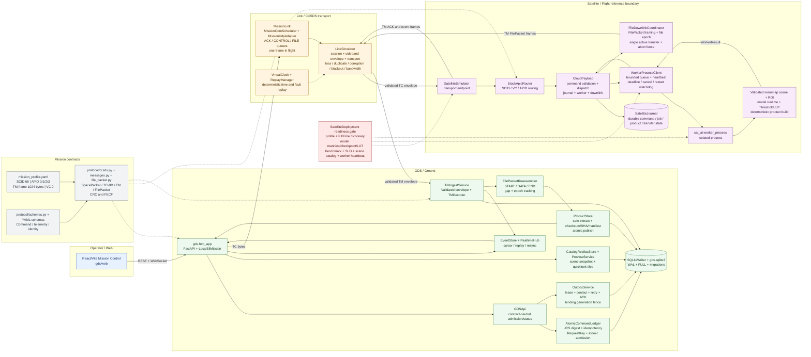
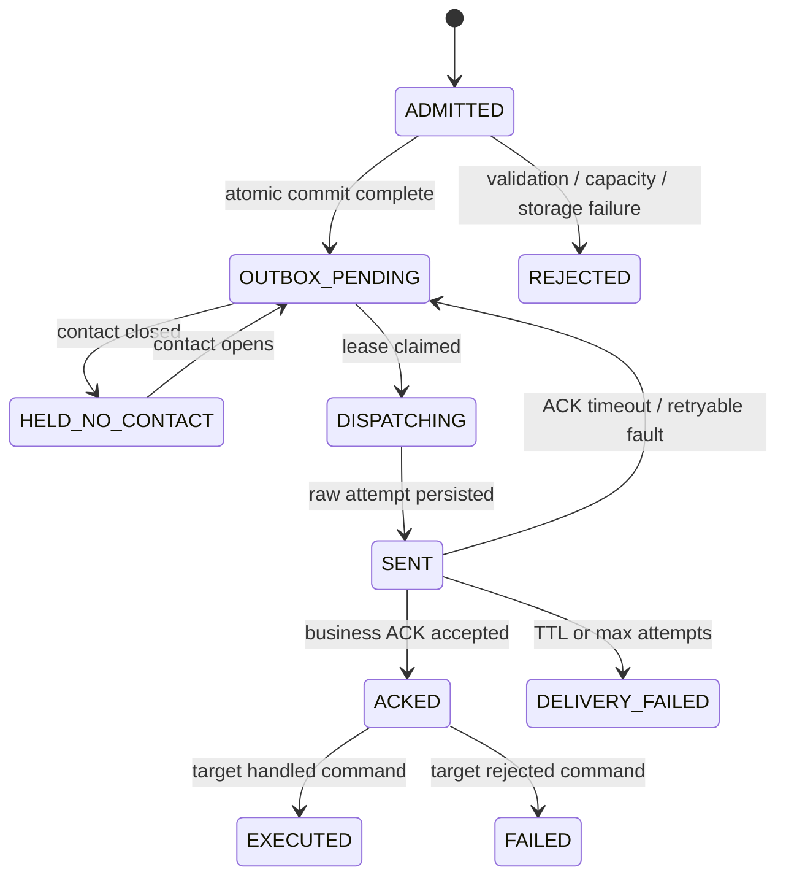
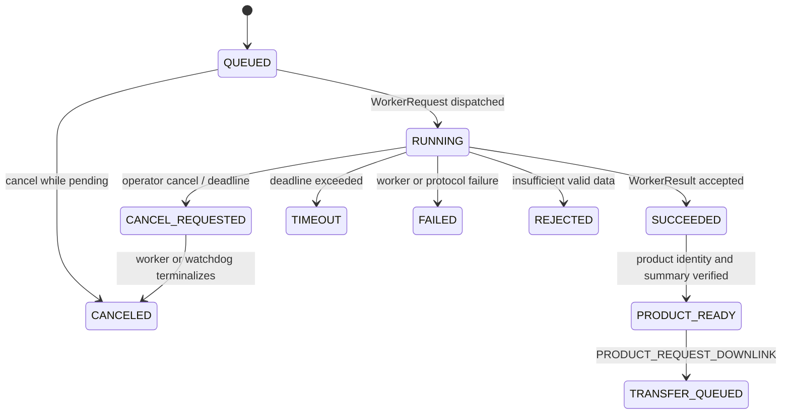
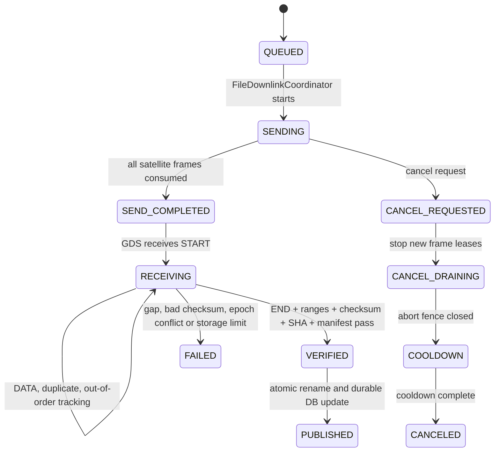
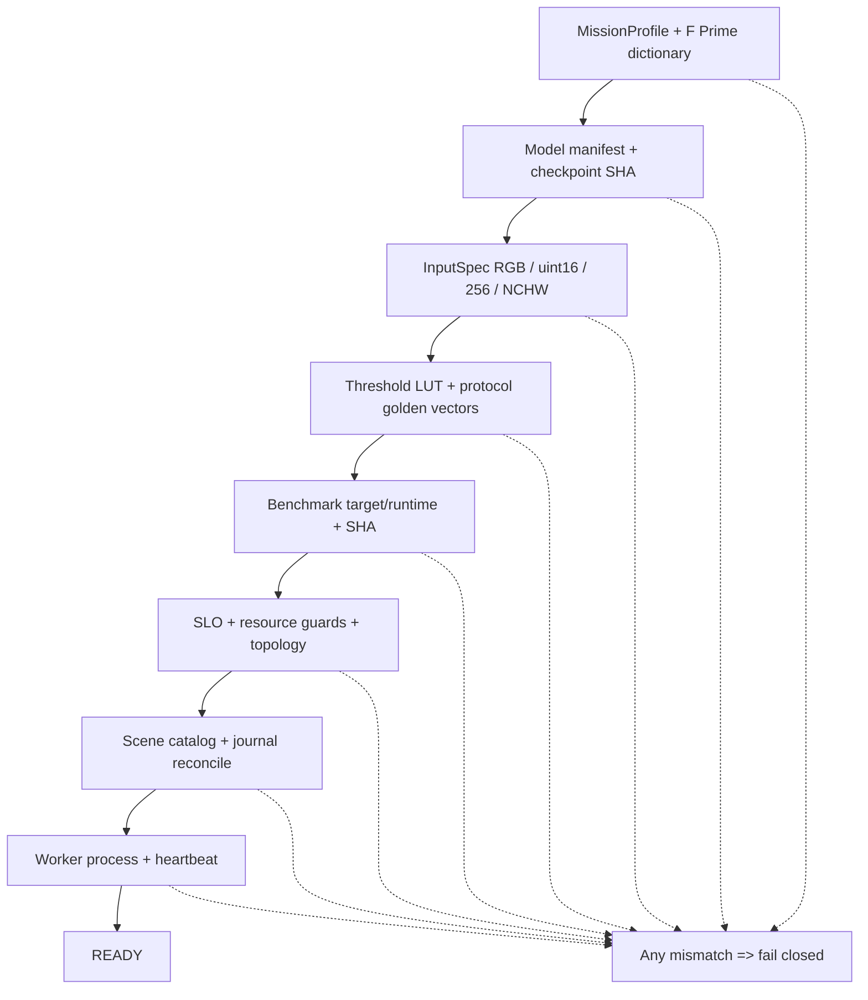

# So do chi tiet GDS va Satellite CCSDS SIL

Tai lieu nay mo ta profile `host_local_sil` dang duoc xac minh trong
repository. Mermaid duoc dung de co the render truc tiep trong GitHub, VS Code
hoac cac cong cu documentation co ho tro Mermaid.

## 1. Kien truc logic



### Boundary va quyen so huu

| Boundary | So huu chinh | Dieu khong duoc lam |
|---|---|---|
| Web | Hien thi catalog, quicklook, ROI, command, product va realtime state | Khong doc TIFF, khong import `sat_ai`, khong tu cap `RequestKey` |
| GDS | Admission, idempotency, outbox, TM ingest, reassembly, verified ground product | Khong goi inference truc tiep |
| Link | Session, sideband envelope, virtual time, fault model, replay va completion gate | Khong an fault vao satellite runtime |
| Flight | Decode TC, route APID, validate mission command, journal, worker admission va TM/FilePacket | Khong bo qua identity, digest hoac readiness gate |
| AI worker | Memmap scene, ROI inference, threshold LUT va staged product | Khong tu sua durable journal |
| Protocol | Wire bytes, schema, fixed-width identity, CRC/FECF va golden vectors | Khong thay doi contract theo UI |

## 2. Sequence ROI den san pham ground

```mermaid
sequenceDiagram
  autonumber
  actor OP as Operator
  participant UI as Web UI
  participant HTTP as FastAPI routes
  participant MISSION as LocalSilMission
  participant API as GDSApi
  participant LEDGER as AtomicCommandLedger
  participant OUTBOX as OutboxService
  participant WIRE as CCSDS codecs
  participant LINK as MissionLink + LinkSimulator
  participant SAT as SatelliteSimulator
  participant PAYLOAD as CloudPayload
  participant SJ as SatelliteJournal
  participant WC as WorkerProcessClient
  participant WORKER as Isolated AI worker
  participant TM as GDS TM ingest
  participant REASM as FilePacketReassembler
  participant STORE as ProductStore

  OP->>UI: Chon scene va ve ROI
  UI->>HTTP: POST /api/commands + Idempotency-Key
  HTTP->>MISSION: submit(body, idempotency_key)
  MISSION->>API: post_commands(body, headers)
  API->>LEDGER: Validate opcode, target, payload, expiry
  LEDGER->>LEDGER: Tinh JCS digest va cap RequestKey
  LEDGER->>LEDGER: BEGIN IMMEDIATE
  LEDGER->>LEDGER: Ghi command + outbox + audit
  LEDGER-->>API: 202 ADMITTED + OUTBOX_PENDING
  API-->>MISSION: Accepted command
  MISSION-->>HTTP: Trace command lifecycle
  HTTP-->>UI: 202 + request_key + mission_digest

  MISSION->>OUTBOX: claim_next()
  OUTBOX->>OUTBOX: Kiem tra contact, lease, generation, session
  OUTBOX-->>MISSION: Lease + bound link
  MISSION->>WIRE: encode Command -> SpacePacket APID 0
  WIRE-->>MISSION: TC Type-BD + CRC/FECF
  MISSION->>OUTBOX: persist_attempt() then mark_sent()
  MISSION->>LINK: send_uplink(TC frame)
  LINK->>LINK: Apply session, clock, fault profile, bandwidth
  LINK->>SAT: Validated ingress transport frame
  SAT->>PAYLOAD: Decode TC and route by SCID/VC/APID
  PAYLOAD->>PAYLOAD: Check target, digest, catalog, config, ROI
  PAYLOAD->>SJ: COMMAND_ACCEPTED + JOB_QUEUED
  PAYLOAD->>WC: Submit immutable job snapshot
  SAT-->>LINK: TM event/ACK packet
  LINK-->>TM: Validated egress transport envelope
  TM->>TM: Decode APID 2, validate session/boot/CRC
  TM->>OUTBOX: ingest_ack(request_key)
  OUTBOX-->>MISSION: ACKED or delivery failure

  WC->>WORKER: WorkerRequest via serialized process boundary
  WORKER->>WORKER: Open memmap TIFF + sidecar
  WORKER->>WORKER: Validate InputSpec, domain, deadline, cancel
  WORKER->>WORKER: ROI inference + ThresholdLUT
  WORKER->>WORKER: Build staged product + bundle/artifact hashes
  WORKER-->>WC: WorkerResult SUCCEEDED
  WC->>PAYLOAD: Callback after result ownership check
  PAYLOAD->>SJ: JOB SUCCEEDED + PRODUCT READY

  MISSION->>WIRE: Build PRODUCT_REQUEST_DOWNLINK command
  MISSION->>LINK: Send downlink request as TC APID 0
  LINK->>SAT: Dispatch downlink command
  SAT->>PAYLOAD: Route to CloudPayload
  PAYLOAD->>SJ: Allocate transfer and file epoch
  PAYLOAD->>PAYLOAD: Start FileDownlinkCoordinator
  PAYLOAD-->>LINK: TM FilePacket START/DATA/END frames
  LINK-->>TM: Deliver egress frames through fault model
  TM->>REASM: Decode and persist START/DATA/END
  REASM->>REASM: Track ranges, duplicates, order, file epoch
  REASM->>STORE: Verify file checksum, bundle SHA, manifest, artifacts
  STORE->>STORE: Atomic publish only after all checks pass
  STORE-->>HTTP: Product state PUBLISHED
  HTTP-->>UI: Product metadata, progress, verified download/tile
  UI-->>OP: PUBLISHED + SHA256_MATCH
```

## 3. Lifecycle va recovery

### 3.1 Command va outbox



`ACKED` trong so do la business command acknowledgement. No khong phai
CLCW, COP-1 hay link-layer delivery acknowledgement.

### 3.2 Job va product tren satellite



Worker chi tao product trong staging. `CloudPayload` giu ownership callback,
kiem tra `ProductRef`, sau do moi ghi terminal state vao `SatelliteJournal`.

### 3.3 Transfer va ground publish



## 4. Readiness gate va profile



| Profile | Trang thai | So do ap dung |
|---|---|---|
| `host_local_sil` | Duong chay reference da verify | `FastAPI -> LocalSilMission -> MissionLink in-process -> SatelliteSimulator -> GDS ingest` |
| `compose_sil` | Topology va UDP bridge da validate; chua claim E2E HTTP nhieu container | `gds -> link UDP bridge -> satellite` tren network internal |
| `jetson-l4t-tensorrt` | Blocked | Can benchmark target va TensorRT optimization profile |

## 5. Identity va durable trace

Mot request phai giu nguyen cac khoa sau tu Web den ground product:

| Khoa | Vai tro | Noi su dung |
|---|---|---|
| `spacecraft_instance_id` | Dinh danh instance spacecraft, U64 hex 16 ky tu | GDS binding, router, TM decoder, ProductRef |
| `RequestKey` | `{ground_instance_id, request_id}` | Idempotency, command, job, event va origin product |
| `SceneRef` | `{catalog_epoch, scene_id, scene_revision}` | Catalog snapshot va science input |
| `ProductRef` | `{spacecraft_instance_id, origin_boot_id, product_id}` | Product staging, downlink, reassembly, publish |
| `link_session_id` + `link_generation` | Dinh danh binding hien hanh | Outbox fence, envelope validation, TM ingest |
| `file_epoch_id` | Dinh danh transfer epoch | FilePacket reassembly, duplicate/out-of-order protection |

Trace mong doi:

```text
Idempotency-Key
    -> RequestKey + mission_digest
    -> command/outbox lease + TC attempt
    -> satellite journal command/job
    -> WorkerRequest/WorkerResult
    -> ProductRef + transfer_id + file_epoch_id
    -> TM/FilePacket reassembly
    -> verified ground product PUBLISHED
```

## 6. Traceability den source code

| Khoi trong so do | File chinh |
|---|---|
| Web operator | `gds/web/src/App.tsx`, `gds/web/src/api/client.ts`, `gds/web/src/api/realtime.ts` |
| HTTP adapter va orchestration local SIL | `gds/http_app.py`, `gds/local_sil.py` |
| Admission va durable outbox | `gds/api.py`, `gds/ledger.py`, `gds/outbox.py`, `gds/writer.py` |
| TM ingest va product publish | `gds/tm.py`, `gds/ingest.py`, `gds/file_reassembly.py`, `gds/product_store.py` |
| Link va deterministic faults | `link_sim/mission_link.py`, `link_sim/link_simulator.py`, `link_sim/transport.py`, `link_sim/replay_manager.py` |
| Flight command/TM boundary | `flight/satellite_simulator.py`, `flight/stock_router.py`, `flight/cloud_payload.py` |
| Worker va inference boundary | `flight/worker_client.py`, `sat_ai/worker_contract.py`, `sat_ai/worker_process.py`, `sat_ai/inference.py` |
| Wire contract | `protocol/profile.py`, `protocol/ccsds.py`, `protocol/messages.py`, `protocol/file_packet.py`, `protocol/schemas.py` |
| Runtime gate | `flight/deployment.py`, `protocol/mission_profile.yaml`, `protocol/runtime_profile.yaml`, `sat_ai/deployment_profile.yaml` |

